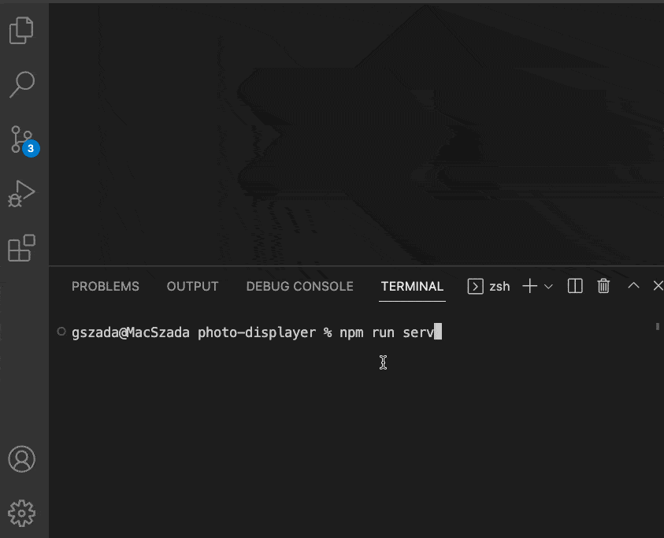

# Summary
1. install & setting Vuex package
2. create source 'login' page.
3. add login source at header.nav


---


# Vuex setting


1. vuex 설치

   
     npm install vuex


2. src 폴더 아래에 vuex 폴더를 추가하고 store.js 파일을 생성

```js
// src/vuex/store.js
import {createStore} from "vuex"
import getters from "./getters"
import mutations from "./mutations"

export default createStore({
  state: {
    user: null,
    isLogin: false,
  },
  mutations,
  getters,

})
```


3. main.js에서 store를 사용할 수 있도록 Vue app에 등록.
4. import 되어있는 getters와 mutations(+ mutation_types)도 생성.
5. 입력된 ID와 PW로 로그인 API를 호출하는 Service 파일을 구현
6. 백엔드는 구현하지 않았으므로 로그인에 성공했다고 가정한 샘플 데이터를 src 폴더 아래에 service 폴더를 추가하고 loginAPI.js 파일을 생성
7. vuex 폴더 아래에 actions.js 파일을 생성
8. vuex/store.js에 actions를 추가
9. Vuex store에 등록된 login 함수를 호출하여 로그인을 진행할 수 있도록 Login.vue 소스를 수정
10.  loginAPI.js의 getUserInfo 함수에서 무조건 로그인에 성공한 데이터를 return


--- 

async가ㅣ 몬데
await은 몬데

갑자기 vuex로 상태관리 하려니까 안됨.

    npm audit fix --force
시전해버림.

result:

    87 vulnerabilities (1 low, 59 moderate, 22 high, 5 critical)


이거저거 안돼서 여러가지 찾아봤는데,
역시나 vuex 문제였던거같음.
제대로 설치가 안됐나 했는데 그건 아니었고,
제대로 설치가 되긴 했는데,
vue.config.js 에서 사용중이던 defineConfig 함수가 있는데,
얘는 Vue ClI 4.x 버전부터 사용할 수 있음.
근데 package.json에서 보니 Cue CLI 버전이 3.x이었던거임.
직접 파일에서 수정할 수도 있지만 npm upgrade 커맨드로 해결가능해보여서 찾아보니 있었음.

    npm install --save-dev @vue/cli-service@latest
시전.

그리고 vue.config.js 파일 가서 확인해보니 5.x 버전으로 업글됐음.
.
.
.
그리고 서버 돌렸는데 안되네 ㅅㅂ


## 2트

> front@0.1.0 build
> vue-cli-service build

이건 안내가 나옴.
일단 vue-cli-service  빌드를 해보자.


vue.config.js 파일에서
transpileDependencies 옵션은 배열 형태로 전달되어야 됨. 
하지만 현재 코드에서는 true로 설정되어 있어 오류가 발생하고 있다함.


vue.config.js 수정.
```js
module.exports = {
  transpileDependencies: ['front']
}

```
npm run build 시전.

## 3트

필살기.

```shell
rm -rf node_modules package-lock.json
npm cache clean --force
npm install
```

## 4트

쓰이는 라이브러리들 싹다 업글함.
그랬는데도 안됨.

이젠 package.json이 엉망진창이 된거같음.
일단 하나하나 버전 따져보자.
1. cache-loader를 제거합니다. Vue CLI 5.x 버전에서는 이미 내장된 캐싱 기능을 사용하므로 별도로 필요하지 않습니다.
2.  "axios": "^1.7.5" -> "axios": "^1.5.1"
3. "core-js": "^3.38.1" -> "core-js": "^3.32.1",
4. "vue": "^3.4.38",
5. "vue-loader": "^17.4.2", 제거
6. "vue-router": "^4.4.3", -> "vue-router": "^4.2.4",
7. "webpack": "^5.94.0" 제거
8. "eslint": "^9.9.1", -> "eslint": "^8.9.1",

말고도 많은데 핵심은 캐시 로더가 주 원인이었던거같음. 그리고 대부분 다운그레이드 됨.

그리고 서버 돌렸음.

## 5트

ESlint가 지랄하는것만 고치면 될 것 같음.

지랄은 아래와 같음.

`vue/multi-word-component-names`

이게 경고도 아니고 왜 에러라고 하는지 어이가 없음.

` /* eslint-disable */ `

`multi-word-component-names` 이기능만 off로 꺼보자.

Go to package.json 
and in the eslintConfig 
object add the following rule: "vue/multi-word-component-names": "off"
or even better: "vue/multi-word-component-names": 0


컴포넌트 네이밍갖고 지랄하는건 해결함.
근데 거의 모든 파일이 imnport,export parsing이 안됨.

## 6트

```js
module.exports = {
  transpileDependencies: true,
  lintOnSave: false
};

```
eslint 죽여버림.
.
.
.
성공!


---

사실 vue3 문법으로 하는게 제일 스마트한 방법이긴함. export default 이딴거 갖다 치우고. 


