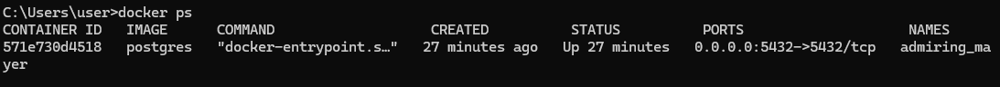

여태 db는 H2로 작업했는데,

로그인 이후 데이터 관리 등을 위해 제대로 된 db로 써보자.

디비는 postgre 쓸거고 도커로 띄울거임


# 도커로 DB 세팅

1. 포스트그레 이미지 받기

`따로 버전 입력 안하면 latest 버전 갖고온다.`
```shell
docker pull postgres
```
2. 이미지 잘 가져 왔나 확인.
```shell
docker images
```
3. 도커 실행
```shell
docker run -d -p 5432:5432 -e POSTGRES_PASSWORD=sa --name postgres postgres
```
- -d : 백그라운드에서 실행하겠다는 뜻.
- -p : 포트포워딩  호스트포트(컨테이너포트) {밖에서 오는 포트 : 실제 도커 내부 포트}
- -e : 환경변수인데  Root 계정의 비번을 'sa'로 세팅하겠다는 뜻.
-  --name : '컨테이너 이름' '이미지 이름'

4. 실행중인 컨테이너 확인해보자
```shell
docker ps
```

5. 컨테이너 postgresql 접속.

컨테이너 id 입력.
```shell
docker exec -it 571e730d4518 bash
```
6. 컨테이너로 들어왔으면 `psql`로 postgres를 입력하여 postgresql로 접속한다.
```shell
psql -U postgres
```
7. 이제 sql문 치면 됨.
```shell
create database test_db
```
디비 하나 만듬.
 
8. 입력창에서 `\l` (소문자 L)커맨드로 확인해보면 디비list를 확인할 수 있다.

확인 했으면 `Q`눌러서 빠져나오자.

9. 계정 생성 및 권한 설정.
```shell
create role tester with login password 'sa';
```
계정명은 'tester' pw는 'sa' 로 만듬. 
10. 이어서 권한 설정도 해주자.
```shell
alter user tester with createdb;
alter user tester with superuser;
```
`\du` 커맨드로 확인 가능.

11. tester 계정에 앞서 생성한 test_db 접근 권한도 같이 주자.
```shell
grant all privileges on database test_db to tester;
```

12. board 테이블 생성, 조회 ㄱㄱ
```shell
CREATE TABLE IF NOT EXISTS board (
idx BIGINT AUTO_INCREMENT PRIMARY KEY,
title VARCHAR(255),
contents VARCHAR(255),
author VARCHAR(255),
created_at TIMESTAMP
);
```

---
ddl 설정해뒀던거 복붙했는데 auto_increment 안됨.
PostgreSQL에서는 auto increment가 지원이 되는 Sequence 라는 타입이 있다함.
아래 처럼 바꿔주면 됨.
---
```shell
CREATE TABLE IF NOT EXISTS board (
idx SERIAL PRIMARY KEY,
title VARCHAR(255),
contents VARCHAR(255),
author VARCHAR(255),
created_at TIMESTAMP
);
```
* idx의 타입은 bigint 에서 sequence로 되었다...

# JDBC , DI 수정 ㄱㄱ

